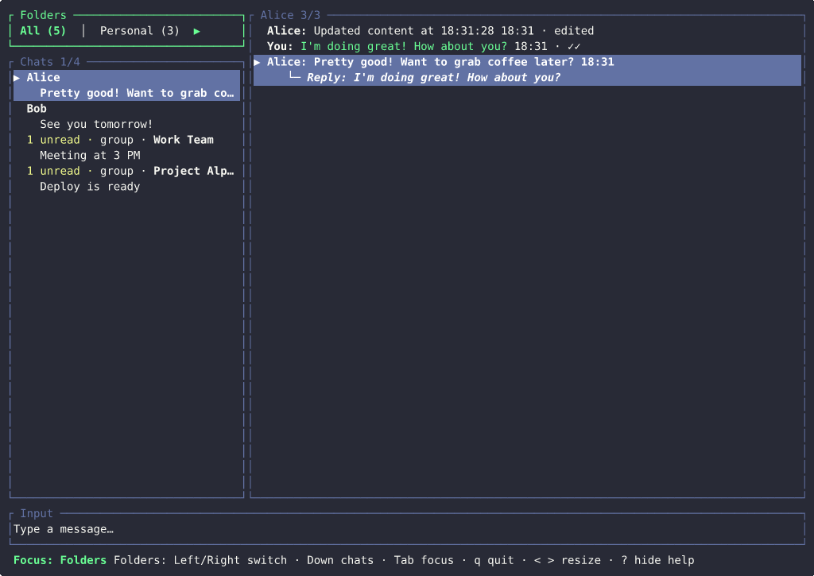

# Dumbgram TUI

Dumbgram TUI is an unofficial, early-stage Telegram client for the terminal. It supports text chat, folders, forum topics, replies, eligible edits and deletes, media downloads, and a credential-free mock mode.



Dumbgram is usable but intentionally limited. Read [Current limitations](#current-limitations) before relying on it as a primary client.

## Install and try it

There are no prebuilt releases or crates.io package. The supported user path is the Nix flake in a source checkout on Linux or macOS:

```bash
git clone https://github.com/DeevsDeevs/dumbgram-tui.git
cd dumbgram-tui
nix run .#dumbgram_tui -- --mock
```

Mock mode uses built-in data and does not need Telegram credentials. To build a reusable local result instead:

```bash
nix build .#dumbgram_tui
./result/bin/dumbgram_tui --mock
```

The repository's Devbox workflow is described under [Development](#development).

## First run with Telegram

You need a Telegram API ID and hash from <https://my.telegram.org>, network access, and an interactive terminal.

### 1. Create a private configuration

`--config PATH` always wins. Without it, Dumbgram reads `config.toml` from the first applicable location:

1. `$DUMBGRAM_CONFIG_HOME`
2. `$XDG_CONFIG_HOME/dumbgram`
3. `%APPDATA%\dumbgram` on Windows
4. `$HOME/.config/dumbgram`
5. `./dumbgram` if no platform config root is available

From a checkout, Unix users can create the default files with private permissions:

```bash
export DUMBGRAM_CONFIG_HOME="${DUMBGRAM_CONFIG_HOME:-${XDG_CONFIG_HOME:-$HOME/.config}/dumbgram}"
umask 077
install -d -m 700 "$DUMBGRAM_CONFIG_HOME"
(set -o noclobber; cat config.example.toml > "$DUMBGRAM_CONFIG_HOME/config.toml")
chmod 600 "$DUMBGRAM_CONFIG_HOME/config.toml"
```

The no-clobber redirection refuses to replace an existing config. Edit the newly copied file:

```toml
[telegram]
api_id = 12345
api_hash = "your_api_hash"
session_file = "session.dat"
```

A relative `session_file` is resolved beside the selected config file. Keep the config and session private and never commit either one.

### 2. Check the configuration

This parses the config and resolves the session path without connecting to Telegram:

```bash
nix run .#dumbgram_tui -- --check-config
```

Add `--config /path/to/config.toml` when using a non-default file.

### 3. Log in

```bash
nix run .#dumbgram_tui
```

The first login asks for your phone number, Telegram login code, and a 2FA password when required. **The phone number and login code are echoed; only the 2FA password is hidden.** Use a private, non-recorded terminal and never share a login code.

A successful login writes reusable Telegram authorization to `session_file`. Treat that file as a secret: keep it out of repositories, shared folders, and backups you do not control. Dumbgram has no in-app logout. If the file may be compromised, revoke the corresponding login in Telegram's **Devices / Active Sessions** screen. Stop Dumbgram before deleting or replacing the file.

On Unix, use a private directory, `umask 077`, and `0600` for config, session, and diagnostic files. Do not assume portable permission hardening on every platform.

## Command reference

```text
dumbgram_tui [OPTIONS]
```

| Option | Behavior |
| --- | --- |
| `--mock` | Run the full TUI with built-in data and no Telegram credentials. |
| `--smoke` | Run the automated off-screen interaction check and exit. It always implies mock mode. |
| `--check-config` | Validate the config and resolved session path without a network connection. |
| `--check-auth` | Connect to Telegram and check whether the saved session is authorized, without interactive login or the TUI. It may create local session/cache paths. |
| `-c, --config PATH` | Use an explicit config file instead of the default location. |
| `--log PATH` | Append runtime diagnostics to `PATH`; see [Diagnostics](#diagnostics). |
| `-h, --help` | Print CLI help. |

`--check-config` and `--check-auth` are mutually exclusive. Neither check can be combined with `--smoke`.

Examples:

```bash
dumbgram_tui --mock
dumbgram_tui --config ~/.config/dumbgram/config.toml
dumbgram_tui --check-config --config ./config.toml
dumbgram_tui --check-auth --config ./config.toml
dumbgram_tui --config ./config.toml --log ./dumbgram.log
```

## Controls

The bottom bar shows controls for the current focus. Character commands below use no Ctrl/Alt modifiers unless stated otherwise.

### Global and navigation

- `Tab` — cycle folders, chats, messages, and input.
- `?` — hide or show the contextual help bar outside input.
- `<` / `>` — resize the chat/message split outside input.
- `q` — quit outside input.
- List boundaries stop; they do not silently move focus.

### Folders and chats

- `Left` / `Right` — switch folders.
- `Down` from folders — focus chats.
- `Up` / `Down` — select a loaded chat.
- Type a letter — jump to the next loaded chat beginning with it.
- `/` — search loaded chat names. Type to filter, use `Up` / `Down` to highlight, `Enter` to open, and `Esc` to clear.
- `Right` — focus messages; `Left` — return to folders.

Search uses substring and simple fuzzy/subsequence matching over the currently loaded chat page. It does not query Telegram.

### Forum topics and messages

- `[` / `]` — switch the selected forum topic.
- Click a visible topic tab — open that topic.
- `Up` / `Down`, `PageUp` / `PageDown`, `Home` / `End` — move through messages.
- `Up` or `PageUp` on the oldest loaded row — fetch an older 20-message page.
- `End`, or `Down` / `PageDown` at a retained-tail gap — refresh the latest page.
- `Left` — return to chats. `Right` intentionally does nothing in messages.
- `Enter` — focus message input.
- `r` — reply to the selected message.
- `e` — edit an eligible message you sent.
- `d` — request deletion of an eligible message you sent, or dismiss a failed local send.
- `c` — copy selected message text through OSC52.
- `o` — open the first web link using the operating system URL opener.
- `s` — save supported media under `$HOME/Downloads`, or `./Downloads` if `HOME` is unavailable.
- `v` — open media previously saved for the selected message; press `s` first when needed.
- `y` — confirm deletion; `n`, `Esc`, or `Ctrl-C` cancels.

Telegram may reject an edit or delete even when Dumbgram offers it. Downloaded links and files are untrusted; inspect them before opening.

### Input, edits, and replies

- `Enter` — send text, save an edit, or submit a reply.
- `Esc` / `Ctrl-C` — cancel input, edit, or reply mode. Per-chat drafts are retained where applicable.
- Arrow keys / `Home` / `End` — move the input cursor.
- `Backspace` / `Delete` — remove text.
- `Ctrl-A` / `Ctrl-E` — move to start/end.
- `Ctrl-B` / `Ctrl-F` — move left/right.
- `Ctrl-D` — delete at the cursor.
- `Ctrl-U` / `Ctrl-K` — delete before/after the cursor.
- `Ctrl-W` — delete the previous word.

Typing non-empty text sends Telegram typing activity on a cooldown. Outbound composition is text-only.

### Mouse

- Click folders, chats, messages, input, or topic tabs to focus/select them.
- Scroll chats without opening another conversation; scroll messages to move selection.
- Right-click a chat or message for available actions. Use the mouse or `Up` / `Down` and `Enter`; `Esc` closes the menu.
- A chat menu can include **Mark read** when Telegram reports unread messages.
- Click a visible `http://` or `https://` message link to open it.
- Drag the divider between chats and messages to resize the panes.
- Mouse input is blocked while deletion confirmation is open.

## Local data, security, and privacy

| Data | Location and behavior |
| --- | --- |
| Config | `config.toml` at the resolved config path. Contains the Telegram API hash. |
| Session | The configured `session_file`, relative to the config when not absolute. Reusable authorization material; revocation must be done in Telegram. |
| UI state | `<config-stem>.state.toml` beside the config. Stores help visibility and pane width. |
| Thumbnail cache | A persistent sibling directory named `<session-file>.dumbgram-media-cache`. Selecting an image may download a thumbnail even if the terminal cannot render it. Remove it manually while Dumbgram is stopped. |
| Saved media | `$HOME/Downloads`, falling back to `./Downloads`. Names are sanitized and existing files are not overwritten. On Linux and macOS files are restricted to mode `0600`; content remains untrusted. |
| Diagnostics | The path passed to `--log`. Logs append rather than truncate and do not rotate automatically. |

Displaying a selected conversation can acknowledge its loaded messages as read whenever Dumbgram believes the terminal is focused. Terminals without focus-event support may therefore mark a selected conversation read while their window is in the background.

`c` emits message text through OSC52. Whether it reaches a local clipboard depends on the terminal and multiplexer, and it may cross an SSH boundary. `o`, link clicks, and `v` launch platform programs (`open`, `xdg-open`, or the Windows `rundll32.exe` opener); use them only for content you trust.

## Diagnostics

Start with the non-networked config check:

```bash
dumbgram_tui --check-config --config ./config.toml
```

Opt into `--check-auth` only when you intend to connect to Telegram. For a short runtime trace:

```bash
umask 077
dumbgram_tui --config ./config.toml --log ./dumbgram.log
```

Current event fields do not intentionally include message bodies, compose keystrokes, API hashes, phone numbers, login codes, or 2FA passwords. Logs **do** include local paths, Telegram numeric identifiers, operation metadata, counts, and error strings. Treat logs as sensitive: use a private path, reproduce briefly, inspect and redact them, share the minimum excerpt, and delete the file when finished.

Common terminal-specific behavior:

- No focus events: background/read awareness is not reliable.
- No OSC52 support or forwarding: copy may appear to do nothing.
- No `xdg-open` on Linux: links and downloaded files cannot be launched.
- Thumbnail preview is attempted only when the terminal environment looks like Kitty or Ghostty and the pane is large enough; placeholders and downloads still work otherwise. Use a private umask when saving sensitive media.
- After an abnormal exit leaves the terminal altered, run `reset`.

Dumbgram attempts bounded reconnects and visible-state refreshes after update errors, terminal focus returns, and a five-minute safety interval. Status and error banners report recovery progress.

## Current limitations

- At most **50 chats per folder** are loaded, with no chat-list pagination. Chat search sees only that page.
- At most the first **50 forum topics per chat** are discoverable, with no topic-list pagination.
- There is no server-side chat search or message search.
- A conversation opens on the latest **20 messages** and fetches older history 20 at a time. The selected chat/topic retains at most **500 Telegram-backed messages**. If compaction creates a newer-history gap, the UI marks it; refreshing the latest page is supported, but smooth forward pagination through the omitted middle is not.
- Outbound messages are text-only. There is no attachment upload, forwarding, reaction, poll, or sticker-send UI.
- Media messages use text placeholders. Dumbgram may cache and attempt to display a selected JPEG/PNG thumbnail, and can save supported media, but it has no full media browser.
- Real loaded replies do not reconstruct a quoted-target preview.
- Editing is limited to eligible own messages under Dumbgram's local time check; deletion is offered only for outgoing messages. Telegram applies the final authorization rules.
- Telegram dialog-filter titles are shown when available. Archived or legacy folders may fall back to server metadata or `Folder N`. Dumbgram cannot create, rename, reorder, or edit folder rules.
- Some non-channel delete updates omit peer identity. A visible removal can be delayed or attributed to the conversation visible when the update arrived until reconciliation refreshes state.
- There is no in-app account switching, account management, or logout. Separate config/session files can select separate accounts on separate launches.
- Without terminal focus events, the selected conversation may be acknowledged as read while the window is backgrounded.

## Development

[Devbox](https://www.jetify.com/devbox/) provides the repository toolchain:

```bash
devbox install
devbox run build
devbox run run:mock
devbox run fmt
devbox run fmt:check
devbox run check
devbox run clippy
devbox run test
devbox run smoke
```

The credential-free demo uses the real mock TUI and reproducible one-off Nix tools; it adds no runtime dependency:

```bash
./assets/record-demo.sh
```

Local runtime files such as repository-local `config.toml`, `session.dat`, `*.dat`, `*.state.toml`, `*.log`, `.devbox/`, and `target/` are ignored by Git. Never commit Telegram credentials or session files.

## License

No license file is currently included. Do not assume permission to redistribute or reuse the code beyond rights provided by applicable law.
